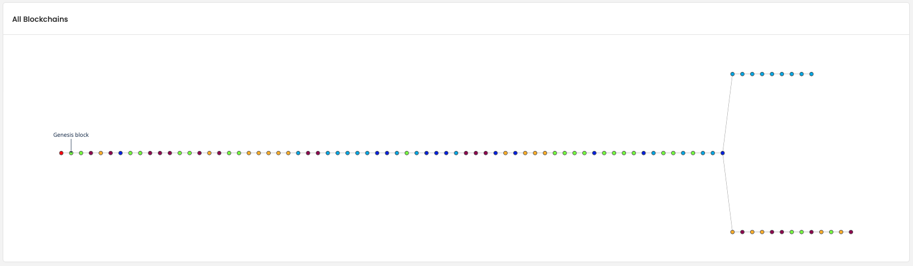
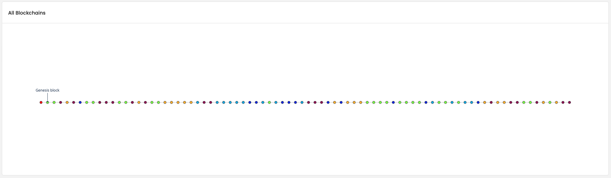
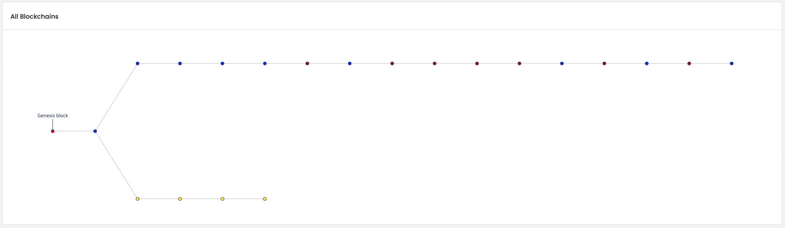
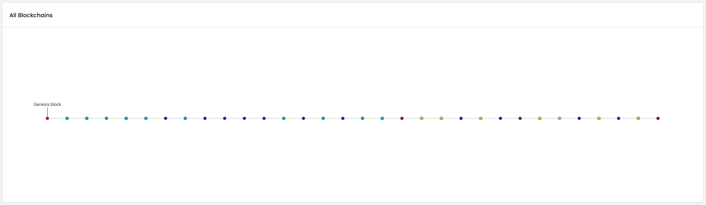

<h1 align="center">
  <br>
  <a href="http://www.amitmerchant.com/electron-markdownify"></a>
  <br><br>
  Blockchain Simulator
  <br>
</h1>

<h4 align="center">Un simulateur de blockchain de type "Proof Of Work" comme le Bitcoin.</h4>

<p align="center">
  <a href="#introduction">Introduction</a> •
    <a href="#mode-demploi">Mode d'emploi</a> •
    <a href="#simulateur-de-blockchain-et-implémentation-des-mineurs">Implémentation</a> •
    <a href="#interface-du-système-blockchain">Interface</a> •
    <a href="#résultats-de-simulation">Résultats</a> •
    <a href="#conclusion">Conclusion</a>
</p>

# Introduction

L'objectif de ce projet est de développer un simulateur de blockchain de type "Proof Of Work" comme le Bitcoin. Pour cela nous utiliserons le langage de programmation python. Dans un soucis d'interactivité nous avons crée une interface sur laquelle on pourra visualiser toutes les données pertinentes ainsi qu'agir sur la blockchain et ses acteurs. 
Pour réaliser ce projet nous avons utilisé les technologies suivantes : Flask pour l'interface, Threads pour gérer les mineurs indépendemment, MQTT pour l'envoie des blocks entre les mineurs, Plotly pour les graphiques techniques.

Tout le code du projet est disponible sur le repositoire *[Github](https://github.com/antonin-lfv/QuantumChain)*. Le *mode d'emploi* est disponible à la fin de ce rapport.

# Mode d'emploi
## Installation

```
pip install -r requirements.txt
```

## Lancer la blockchain

Se déplacer dans le dossier `Blockchain`
```
cd Blockchain
```

Lancer le fichier main.py
```
python main.py
```

## Lancer l'interface

Si la blockchain n'a jamais été lancée, il faut d'abord lancer la blockchain comme indiqué ci-dessus.

```bash
flask run
```

## Réinitialiser la simulation

- Modifier le contenu de miners.json en une liste vide `[]`
- Vider le dossier `Blockchain/miners_blockchain`

# Simulateur de Blockchain et Implémentation des Mineurs

Le simulateur de blockchain repose sur le mécanisme de preuve de travail (PoW). Au début, $n$ mineurs sont créés, chacun fonctionnant sur un thread distinct. Chaque mineur détient une copie du bloc "Genèse" pour initialiser sa blockchain. 

Le cœur de l'activité des mineurs est le minage. Cela implique de changer un "Nonce" (un nombre entier aléatoire) jusqu'à ce que le hash du bloc, dérivé de l'algorithme SHA-256, commence par $k$ zéros. Trouver un tel bloc est une tâche ardue, mais une fois qu'un mineur réussit, il transmet ce bloc à tous les autres mineurs via le protocole MQTT. Il ajoute également ce bloc à sa blockchain et prépare une transaction de récompense pour lui-même dans le prochain bloc à miner, avec une récompense fixée à 5.8 tokens.

La réception d'un bloc par un mineur peut entraîner deux scénarios :
1. *Mineur Honnête* : Le mineur vérifie d'abord l'intégrité du bloc reçu. Il contrôle l'index du bloc, les spécificités du hash, le hash précédent, et calcule le hash actuel. Si le bloc est validé, il est ajouté à sa blockchain. En outre, si certaines transactions qu'il était en train de valider figurent déjà dans le bloc reçu, il les retire de sa liste de transactions en attente et les remplace par d'autres transactions non validées pour le prochain bloc. 
2. *Mineur Malhonnête* : Il refusera tous les blocs reçus et continuera de miner uniquement sur sa propre blockchain.

Techniquement, chaque mineur est créé dans un thread distinct et possède un nom unique. Il s'abonne au topic MQTT `blockchain/blocks` pour partager et recevoir des blocs. Lors du minage, le mineur varie le Nonce du bloc en cours et calcule le hash avec SHA-256. Une fois qu'il trouve un hash satisfaisant la condition des $k$ zéros, il ajoute ses détails au bloc et l'intègre à sa blockchain. Il met à jour ensuite les statistiques de sa blockchain pour l'interface utilisateur.

Lorsqu'un mineur reçoit un bloc d'un autre mineur via MQTT, il agit selon sa nature (honnête ou malhonnête). Un mineur honnête vérifie l'intégrité du bloc, et s'il est validé, il l'intègre à sa blockchain. En cas de malhonnêteté, il refusera systématiquement les blocs entrants.

Enfin, pour assurer la cohérence de la blockchain, si un mineur honnête observe que sa version de la blockchain est en retard de plus de 3 blocs par rapport à la chaîne la plus longue, il adoptera cette dernière. Un mineur malhonnête, en revanche, restera fidèle à sa propre version.

# Résultats de simulation

## Simulation avec que des mineurs honnêtes 

On commence avec 5 mineurs honnêtes, ils minent tous et acceptent de recevoir des blocs d'autres mineurs pour le valider. Si on affiche les blockchains on obtient une seule version.


Il se peut qu'un mineur trouve un bloc juste avant qu'un autre envoie le siens et donc il va se créer un Fork ou le mineur va être isolé. Voila le résultat.



Quand la blockchain la plus longue est 3 blocs devant alors le mineur isolé se déplace sur cette dernière.




## Simulation en ajoutant un mineurs malhonnêtes

Lorsqu'on ajoute un mineur malhonnête il va créer un fork dès qu'il va miner un bloc, par exemple:



Et ce mineur va rester sur sa version tant qu'il est malhonnête. Si il parvient à être 3 blocs plus grand que la blockchain principale alors il va attirer tous les autres mineurs et va donc gagner énormément de tokens. Mais ce scénario est impossible du fait de la loi des grands nombres.
S'il redevient honnête alors il va se remettre sur la blockchain principale dès la prochaine réception d'un bloc d'un autre mineur.

Notre exemple devient alors :



Il perd donc tous les tokens gagné lorsqu'il était malhonnête.
