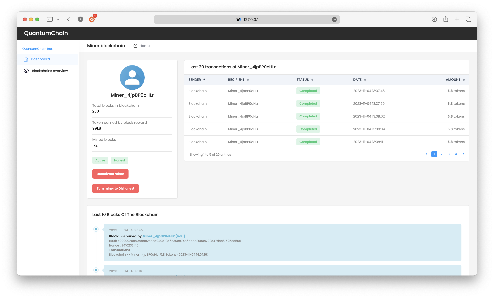
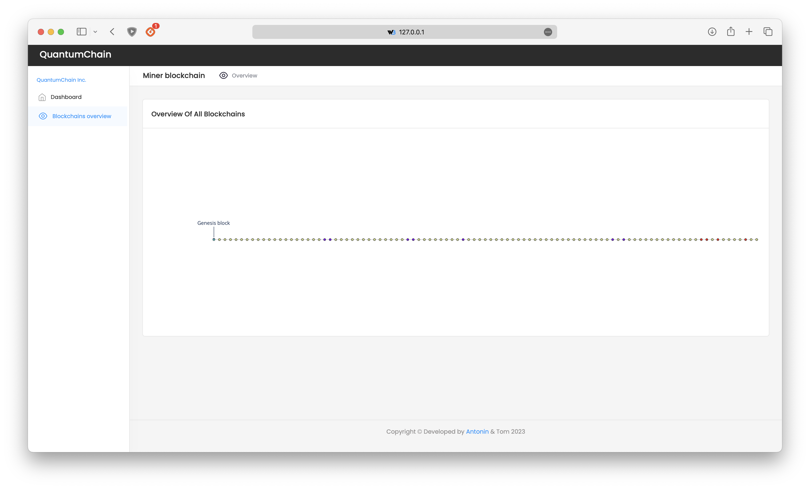

<h1 align="center">
  <br>
  <a href="http://www.amitmerchant.com/electron-markdownify"></a>
  <br><br>
  Blockchain Simulator
  <br>
</h1>

<h4 align="center">Un simulateur de blockchain de type "Proof Of Work" comme le Bitcoin.</h4>

<p align="center">
  <a href="#introduction">Introduction</a> •
    <a href="#logique-de-la-blockchain">Logique de la blockchain</a> •
    <a href="#implémentation-de-la-version-réseau">Implémentation de la version réseau</a> •
    <a href="#interface-de-la-version-réseau">Interface de la version réseau</a> •
    <a href="#mode-demploi-version-réseau">Mode d'emploi version réseau</a>
</p>

> **Note:** Une version multi-threadée est disponible sur la branche `main`.

# *Introduction*

Cette version du projet de création d'un simulateur de blockchain est une version réseau. Elle permet de simuler un réseau de mineurs qui communiquent entre eux via un broker MQTT et une API. Chaque mineur est un nœud du réseau et possède sa propre blockchain. Les mineurs communiquent entre eux pour mettre à jour leur blockchain et ainsi maintenir la cohérence du réseau.

# *Logique de la blockchain*

Le simulateur de blockchain repose sur le mécanisme de preuve de travail (PoW). Chaque mineur participant commence à partir d'une copie du bloc "Genèse" pour initialiser sa blockchain.

Le cœur de l'activité des mineurs est le minage. Cela implique de changer un "Nonce" (un nombre entier aléatoire) jusqu'à ce que le hash du bloc, dérivé de l'algorithme SHA-256, commence par k zéros. Trouver un tel bloc est une tâche ardue, mais une fois qu'un mineur réussit, il transmet ce bloc à tous les autres mineurs. Il ajoute également ce bloc à sa blockchain et une transaction de récompense pour ce mineur est ajouté dans le prochain bloc à miner, avec une récompense fixée à 5.8 tokens.

La réception d'un bloc par un mineur peut entraîner deux scénarios :
1. *Mineur Honnête* : Le mineur vérifie d'abord l'intégrité du bloc reçu. Il contrôle l'index du bloc, les spécificités du hash, le hash précédent, et calcule le hash actuel. Si le bloc est validé, il est ajouté à sa blockchain et une récompense pour le mineur ayant envoyé le bloc est ajouté au prochain bloc. En outre, si certaines transactions qu'il était en train de valider figurent déjà dans le bloc reçu, il les retire de sa liste de transactions en attente et les remplace par d'autres transactions non validées pour le prochain bloc.

2. *Mineur Malhonnête* : Il refusera tous les blocs reçus et continuera de miner uniquement sur sa propre blockchain tout en continuant à envoyer ses blocs aux autres mineurs.

Enfin, pour assurer la cohérence de la blockchain, si un mineur honnête observe que sa version de la blockchain est en retard de plus de 3 blocs par rapport à la chaîne la plus longue, il adoptera cette dernière. Un mineur malhonnête, en revanche, restera fidèle à sa propre version.


# *Implémentation de la version réseau*

Dans la version réseau de la simulation de blockchain, nous observons une configuration où les mineurs sont répartis sur des machines distinctes, chacune agissant comme un nœud indépendant au sein du réseau. Chaque mineur est conçu pour exécuter deux threads principaux : le premier dédié au minage des blocs, et le second qui prend en charge l'API du mineur. Cette API joue un rôle crucial dans la communication inter-nœuds et le fonctionnement global du réseau.

Pour assurer l'unicité de chaque mineur au sein du réseau, un identifiant unique est généré au démarrage de la simulation. Cet identifiant est créé à partir d'une chaîne de caractères aléatoire. Avant le lancement, l'utilisateur doit configurer le système en fournissant les détails réseau nécessaires, incluant l'adresse IP du broker MQTT, l'adresse IP locale du mineur et le port d'écoute. Le port 5101 a été choisi comme standard pour cette communication.

Une fois le mineur opérationnel, il procède à l'abonnement à deux topics MQTT essentiels : *`"blockchain/blocks"`* pour l'échange des blocs minés avec les autres nœuds, et *`"blockchain/discovery/+"`* pour la découverte et l'annonce des mineurs actifs dans le réseau. Le deuxième topic est personnalisé avec l'ajout de l'identifiant unique du mineur, et les messages échangés sur ce canal contiennent les informations importantes comme le nom du mineur, son adresse IP et son port d'écoute. Pour assurer une découverte en temps réel des nœuds, un message de présence est envoyé toutes les 30 secondes via un autre thread, et ces messages sont configurés en mode *`retain`*. Cela garantit que tout mineur qui s'abonne au topic reçoit immédiatement l'information sur les mineurs déjà présents. Cette stratégie permet à chaque mineur de maintenir et de mettre à jour une liste des autres mineurs actifs, facilitant ainsi la communication et l'interaction directes.

En cas de déconnexion, un mineur publie un message de "fin", signalant aux autres nœuds son départ et permettant ainsi la suppression de ses données de présence du broker MQTT, maintenant ainsi la liste des mineurs actifs à jour.

La gestion du consensus dans ce réseau distribué est finement ajustée pour refléter le comportement des nœuds selon leur intégrité. Un mineur malhonnête ignorera tout simplement les blocs proposés par les autres via le topic *`"blockchain/blocks"`*. À l'inverse, un mineur honnête utilisera son API pour effectuer une vérification proactive de l'état de sa blockchain par rapport à celles des autres mineurs. Cela se fait en interrogeant les autres mineurs sur la longueur de leur blockchain via des requêtes API HTTP, mises en œuvre avec Flask. Si un mineur découvre qu'une blockchain est plus longue que la sienne de trois blocs ou plus, il demandera à ce nœud de lui envoyer la chaîne complète pour la copier et mettre à jour sa propre version. Cette procédure de vérification et de mise à jour est cruciale pour maintenir l'intégrité et la cohésion de l'ensemble du réseau blockchain.

# *Interface de la version réseau*

Pour cette implémentation, chaque mineur a donc accès à sa version de la blockchain, et donc sa page principale est son dashboard lui présentant ses statistiques.



Nous avons ajouté une page de visualisation des forks de tous les mineurs connectés au mineur qui lance l'interface pour mieux visualiser les situations.



# *Mode d'emploi version réseau*

## Installation

```bash
git clone https://github.com/antonin-lfv/QuantumChain.git
```

```bash
git checkout online_app
```

Installer les dépendances
```bash
pip install -r requirements.txt
```

Si vous êtes sur un OS Unix il faudra possiblement installer graphviz avec apt-get
```bash
sudo apt-get install graphviz
```

## Configuration

Depuis le dossier *`Blockchain/`* créer le fichier `app_config.json` en mettant l'ip du broker MQTT, l'ip de l'API (votre IP) et le port de l'API (on prendra 5101)
```json
{
  "MQTT_BROKER_IP": "ip_broker",
  "API_IP_FLASK_MINER": "ip_api",
  "API_PORT_FLASK_MINER": "port_api"
}
```

## Service MQTT

Pour lancer le broker MQTT (Sur un seul PC)
```bash
brew services start mosquitto
```

Pour redémarrer mosquitto broker (pour vider les topics si besoin)
```bash
brew services restart mosquitto
```

## Lancer la blockchain

Se déplacer dans le dossier *`Blockchain/`* et lancer le fichier main.py
```bash
cd Blockchain
python3 main.py
```

Pour reinitialiser la blockchain (sur un OS unix)
```bash
chmod u+x clean.sh
./clean.sh
```

Sinon 
- supprimer le fichier blockchain_data.json
- remplacer le contenu de miner.json par {}


## Lancer l'interface
Dans un autre terminal, lancer l'interface Flask
```bash
flask run
```
