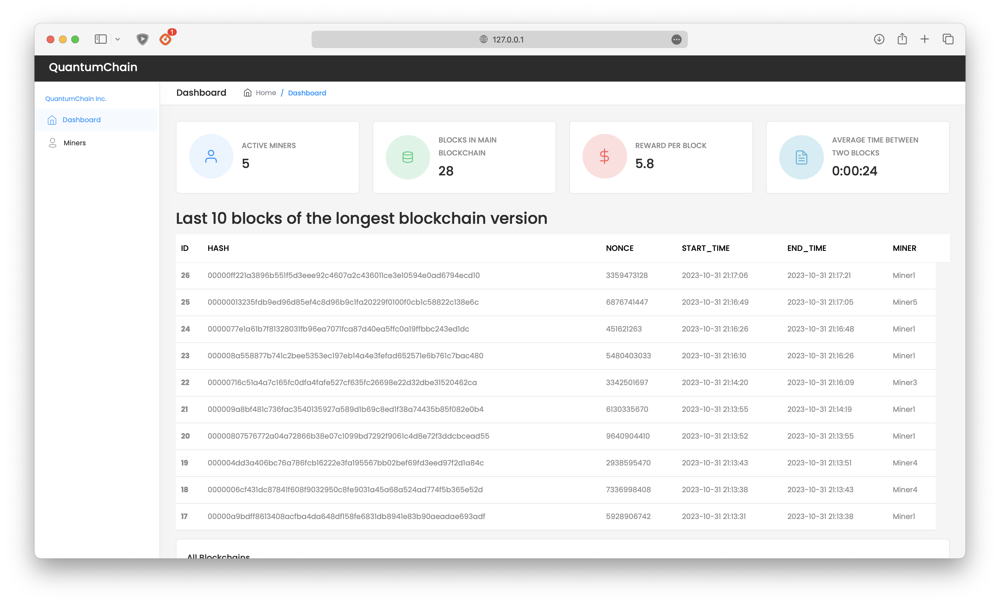
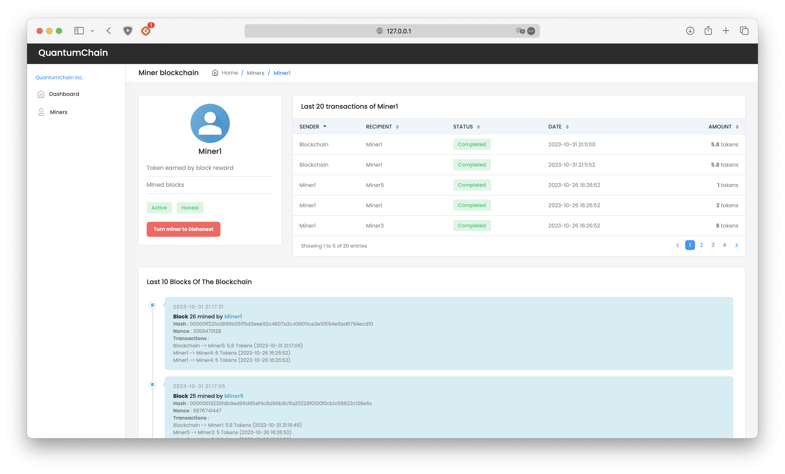

<h1 align="center">
  <br>
  <a href="http://www.amitmerchant.com/electron-markdownify"></a>
  <br><br>
  Blockchain Simulator
  <br>
</h1>

<h4 align="center">Un simulateur de blockchain de type "Proof Of Work" comme le Bitcoin.</h4>

<p align="center">
  <a href="#introduction">Introduction</a> •
    <a href="#implémentation-de-la-version-multi-threading">Implémentation de la version multi-threading</a> •
    <a href="#interface-de-la-version-multi-threading">Interface de la version multi-threading</a> •
    <a href="#mode-demploi-version-multi-threading">Mode d'emploi version multi-threading</a>
</p>

> **Note:** Une version avec les mineurs en réseau est disponible sur la branche `online_app`.

# Introduction

Cette version du simulateur de blockchain est une implémentation de la blockchain de type "Proof Of Work" (PoW) comme le Bitcoin. Le simulateur est écrit en Python et utilise le protocole MQTT pour la communication entre les mineurs, qui sont eux déployés en multi-threading. L'interface utilisateur est développée en HTML, CSS et JavaScript.

# *Implémentation de la version multi-threading*

Dans le cadre d'une simulation de blockchain Proof of Work (PoW) multi-threadée, l'architecture envisagée est conçue pour fonctionner intégralement sur un seul ordinateur. Ce dernier fait office d'une plateforme où n mineurs virtuels sont crées, chacun exécuté dans un thread séparé pour imiter la distribution et la concurrence que l'on retrouve dans une véritable blockchain. Chaque mineur possède sa propre copie de la blockchain, qui initie avec le bloc "Genèse" dans le cas où il s'agit d'un nouvel ajout au réseau de simulation.

Au cœur de cette simulation réside le protocole de communication MQTT, essentiel pour l'échange d'informations entre les mineurs. Les mineurs s'abonnent au topic *`"blockchain/blocks"`*, qui sert de canal pour la diffusion et la réception des blocs nouvellement minés.

Le processus de minage se déroule comme suit : lorsqu'un mineur parvient à calculer le hash adéquat qui répond aux critères définis par la difficulté de la blockchain, il procède à la publication de ce bloc sur le réseau. La transmission est faite à travers le protocole MQTT précédemment mentionné, en utilisant le même topic *`"blockchain/blocks"`* pour informer tous les participants du réseau du nouveau bloc.

Quand un bloc est reçu par le biais de MQTT, le comportement du mineur récepteur dépendra de son état : honnête ou malhonnête. Dans le cas d'un mineur intègre, une vérification de l'intégrité du bloc reçu est effectuée. Si le bloc est authentifié et jugé valide, il est alors ajouté à la copie locale de la blockchain que détient le mineur. Par opposition, un mineur malhonnête est programmé pour rejeter systématiquement les blocs qui lui parviennent, illustrant ainsi les scénarios de sécurité et de confiance auxquels doivent faire face les réseaux blockchain réels.

Pour ce qui est de la gestion du consensus au sein de cette simulation, la tâche est simplifiée par le fait que tous les mineurs résident sur la même machine. Ainsi, pour établir le consensus, il suffit de comparer les longueurs des différentes copies de la blockchain présentes sur le disque. Le système sélectionne la chaîne la plus longue, qui représente la majorité et la validité selon les règles du protocole PoW, et la copie dans le fichier de la blockchain du mineur qui cherche à actualiser son état en fonction du consensus. Ce mécanisme est crucial car il garantit l'uniformité et la cohérence du réseau de simulation en imitant le fonctionnement de la blockchain dans un environnement distribué.


# *Interface de la version multi-threading*

L'interface utilisateur joue un rôle essentiel dans la visualisation et la gestion d'un simulateur de blockchain. Dans ce contexte, l'interface est élaborée avec l'aide de Flask, un micro-framework Python populaire pour le développement web, qui permet de créer une expérience utilisateur fluide et intuitive.

## *Page d'accueil*

### Vue d'ensemble du système 
Dès l'arrivée sur la page d'accueil, l'utilisateur est immédiatement informé de l'état actuel du système. Les informations clés, telles que le nombre de mineurs actuellement actifs, la taille de la blockchain la plus longue, la récompense en tokens attribuée pour chaque bloc miné et le temps moyen nécessaire pour découvrir un nouveau bloc, sont affichées.

### Détails des blocs
Pour une analyse plus approfondie, les dix derniers blocs de la blockchain la plus longue sont listés, affichant des détails tels que son index dans la chaîne, le hash unique du bloc, le nonce, la date de création du bloc par le mineur qui l'a miné, la date de validation du bloc et le mineur qui a découvert le bloc.



### Visualisation des forks
Un aspect crucial de toute blockchain est la possibilité de forks, où différentes versions de la chaîne peuvent coexister. Un graphique est intégré pour visualiser toutes les blockchain en cours, aidant à identifier et à comprendre les forks et leurs origines. Chaque mineur est associé à une couleur pour bien les identifier sur le graphique. Au survol des points sur le graphique le hash, le miner et l'index du bloc apparait.


## *Page des mineurs*

### Vue d'ensemble des mineurs
Cette page est dédiée à la présentation des caractéristiques de tous les mineurs, qu'ils soient actifs ou non. Les informations clés incluent la quantité de tokens gagnés à travers les récompenses de minage, le nombre total de blocs qu'ils ont découverts, la taille de leur version actuelle de la blockchain, et un indicateur de leur honnêteté.


  
## *Page de détails d'un mineur spécifique*

### Caractéristiques du mineur
Cette section offre une vue détaillée de la performance et des attributs d'un mineur spécifique. Elle indique si le mineur est actuellement actif, son niveau d'honnêteté (avec un bouton pour le modifier), le nombre total de tokens qu'il a gagnés par récompense après avoir miné un bloc et le nombre de blocs qu'il a minés.

### Historique des transactions
Les vingt dernières transactions impliquant le mineur (en tant qu'émetteur ou receveur) sont affichées pour une meilleure compréhension de ses activités.

### Détails des blocs
Tout comme la page d'accueil, les dix derniers blocs minés par ce mineur sont listés avec des détails approfondis, offrant une vue complète de sa contribution à la blockchain.




# *Mode d'emploi version multi-threading*

## Installation

```bash
git clone https://github.com/antonin-lfv/QuantumChain.git
```

```bash
pip install -r requirements.txt
```

## Lancer la blockchain

Se déplacer dans le dossier *`Blockchain/`* et lancer le fichier main.py
```bash
python3 main.py
```

## Réinitialiser la simulation

Soit:
- Modifier le contenu de miners.json en une liste vide `[]`
- Vider le dossier `Blockchain/miners_blockchain`

ou si vous êtes sur un OS Unix, depuis le dossier *`Blockchain/`*
```bash
chmod u+x clean.sh 
./clean.sh
```

## Lancer l'interface

Dans un autre terminal, lancer l'interface Flask
```bash
flask run
```
